  

  

## 📌 About Me
- About Me: Backend is my love, low-code is my life
- Framework: SpringBoot, ASP.Net, ExpressJS, JSP-Servlet, ElysiaJS, VueJS, ReactJS, NextJS, NestJS, Axum, Actix, Rocket

## 🧠 My Focus Areas
- Web Developer (C#, JS/TS)
- Low Code (Rust, C++)
- DSA

## 📊 GitHub Stats & Trophies

  
  

  

  

  

## 🛠️ Languages & Tools

> ## Programming Languages

     

> ## Frontend

      

> ## Backend

  

> ## Database

  

> ## DevOps & Cloud

   

> ## Tools

 

  

  

  

